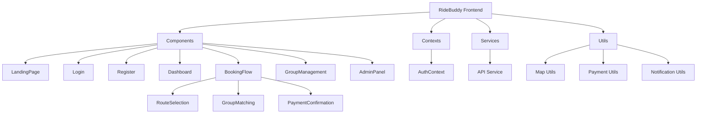

```mermaid
graph TD
    A[RideBuddy Frontend] --> B[Components]
    A --> C[Contexts]
    A --> D[Services]
    A --> E[Utils]
    
    B --> B1[LandingPage]
    B --> B2[Login]
    B --> B3[Register]
    B --> B4[Dashboard]
    B --> B5[BookingFlow]
    B --> B6[GroupManagement]
    B --> B7[AdminPanel]
    
    C --> C1[AuthContext]
    
    D --> D1[API Service]
    
    E --> E1[Map Utils]
    E --> E2[Payment Utils]
    E --> E3[Notification Utils]
    
    B5 --> B5A[RouteSelection]
    B5 --> B5B[GroupMatching]
    B5 --> B5C[PaymentConfirmation]
```